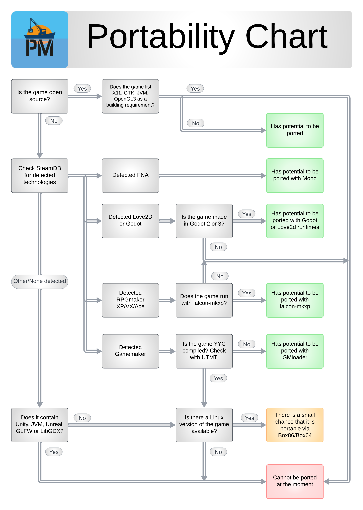

To determine the possibility of a game being ported a flowchart has been made.

!!! tip
    Sites like [:simple-steamdb: SteamDB](https://steamdb.info/) can be used to find relevant info on the technologies uses by commercial games.

!!! warning
    This flowchart is to be used a guide to determine the feasability of a game being portable, this does not guarantee succes.
