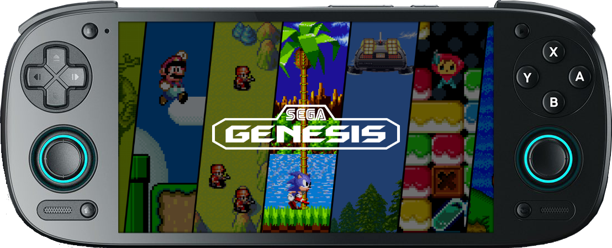

---
hide:
  - navigation
  - toc
---

<link rel="stylesheet" href="https://cdn.jsdelivr.net/npm/bootstrap-icons@1.11.1/font/bootstrap-icons.css">






{% set thirty_days_ago_str = now().fromtimestamp(prev_month_ts).strftime('%Y-%m-%d') %}


  
  
    
  


<!-- ===== HERO ===== -->
<section class="hero">
  

    <h1>Real PC &amp; indie games, running natively on your handheld</h1>
    
Stardew Valley, Celeste, Balatro, Limbo, and {{ total_port_count }}+ more &mdash; installed and running on cheap Linux-based handhelds with PortMaster. Completely free. Not emulation.

    

      <a href="games/" class="hero-btn hero-btn-primary">Discover {{ total_port_count }}+ Games</a>
      <a href="installation/installing-portmaster/" class="hero-btn hero-btn-secondary">Get PortMaster</a>
    

  

  

    

      
      <video class="overlay-video" autoplay loop muted playsinline>
        <source src="assets/videos/homepage.mp4" type="video/mp4">
      </video>
    

  

</section>

<!-- ===== STATS CARDS ===== -->
<section class="home-section">
  

    

      <i class="bi bi-download stats-card-icon"></i>
      {{ "{:,}".format(total_downloads) }}
      Downloads
    

    

      <i class="bi bi-controller stats-card-icon"></i>
      {{ device_count }}+
      Devices Supported
    

    

      <i class="bi bi-person-workspace stats-card-icon"></i>
      {{ porter_count }}
      Porters
    

    

      <i class="bi bi-calendar-plus stats-card-icon"></i>
      {{ new_this_month.value }}
      Added This Month
    

  

</section>

<!-- ===== SHOWCASE (the library) ===== -->
<section class="showcase">
  

    
      
    
  

  

    

      <h2>{{ total_port_count }}+ games, ready to install.</h2>
      
Stardew Valley, Celeste, Balatro, Half-Life, Doom &mdash; plus hundreds you've never heard of. Pick one, press install, play. No setup, no terminal.

    

  

  
Every port is free and community-made &mdash; and runs on {{ device_count }}+ Linux handhelds.

</section>

<!-- ===== GET INVOLVED (Community + Contribute) ===== -->
<section class="home-section">
  

    

      <i class="bi bi-discord get-involved-icon"></i>
      <h3>Join the Community</h3>
      
Share your favorite ports, get help with installation, and stay updated on the latest releases with thousands of fellow handheld enthusiasts.

      <a href="https://discord.gg/eqjK6yNQS4" class="hero-btn hero-btn-secondary">Join Our Discord</a>
    

    

      <i class="bi bi-github get-involved-icon"></i>
      <h3>Contribute</h3>
      
PortMaster is open-source and built by a passionate global community. Help make handheld gaming accessible for everyone.

      <a href="https://github.com/PortsMaster/PortMaster-New" class="hero-btn hero-btn-secondary">View on GitHub</a>
    

  

</section>
