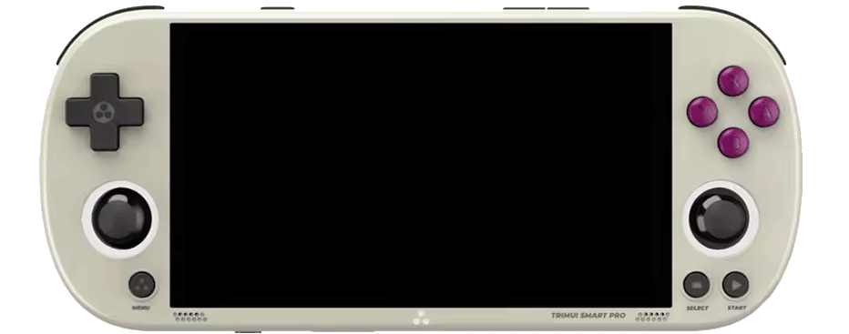

  
  <video class="overlay-video" autoplay loop muted>
    <source src="assets/videos/homepage.mp4" type="video/mp4">
  </video>

 

# Welcome to the PortMaster Wiki! :material-nintendo-game-boy:

PortMaster is a powerful, community-driven platform that simplifies the process of managing game ports on Linux handheld devices. Designed for retro gaming enthusiasts, it offers an easy way to download, install, and update PC game ports on custom firmware setups. Whether you're playing indie classics or commercial titles, PortMaster ensures smooth compatibility for a wide range of games.

## Features

- **Game Port Management**: Easily install and update game ports, both free and commercial titles.
- **Multi-Device Support**: Compatible with a variety of Linux handheld devices like AmberELEC, ArkOS, and muOS.
- **User-Friendly Interface**: Simple graphical interface (GUI) to handle installations and updates with ease.
- **Community Contributions**: Actively encourages community members to suggest new ports and improve the platform.
- **Automated Library Management**: Automatically handles necessary libraries for seamless gameplay, preventing system conflicts.

## Preview

<table>
  <tr>
    <td></td>
    <td></td>
  </tr>
  <tr>
    <td></td>
    <td></td>
  </tr>
</table>

## Supported Games

PortMaster hosts a variety of games, from indie gems to classic titles. 

<iframe src="https://player.vimeo.com/video/1083313795?badge=0&amp;autopause=0&amp;player_id=0&amp;app_id=58479" frameborder="0" allow="autoplay; fullscreen; picture-in-picture; clipboard-write; encrypted-media" style="position:absolute;top:0;left:0;width:100%;height:100%;" title="Portmaster_1000-Final"></iframe>

## Installation

#### Prerequisites

Ensure your device is running a compatible custom firmware (CFW), such as AmberELEC, ArkOS, or muOS. PortMaster is intended for Linux-based handheld systems.
Installation Steps

#### Installation Steps
Most supported CFWs include PortMaster by default. If not, you can install it manually using a simple installer script. For complete instructions, visit the [:material-download: Installation](installation/installing-portmaster.md) page!

## Community

The PortMaster community thrives on collaboration. Join us on Discord to share your thoughts, contribute to development, or just talk about games: &nbsp;[:simple-discord: Discord](https://discord.gg/eqjK6yNQS4)

## Licenses

PortMaster is open-source software, and its components are released under their respective licenses. The platform is built on contributions from the open-source community, and special thanks go out to those who have made it possible.

## Credits

PortMaster is a community-driven project, supported by passionate developers and contributors from around the world. Special thanks to all the developers who continue to make handheld gaming a reality, as well as the open-source community for their ongoing support and contributions.

